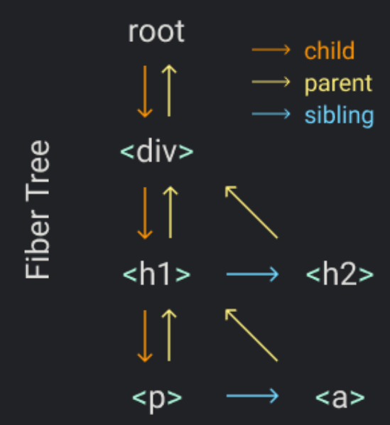

# 4

Part 4 expands on the idea of concurrency by introducing 'fibers'. A `fiber` is a 'unit of work' in the rendering process represented by a JS object. Each fiber corresponds to one react element. Fibers are a powerful design approach. Some of the pros to using fibers:
- Pause and resume rendering at will (rendering is interruptable)
- Split rendering into smaller, manageable chunks to be processed concurrently.
- Prioritize updates
  - Ex: Animations should occur before data fetching

In practice, a fiber looks essentially like a linked list node which contains:
- Element type
- Props
- State (if applicable)
- Child (reference to the first child fiber)
- Sibling
- Return (reference to parent fiber)
- Effect tag (information about what kind of update is needed)

How fibers work in practice:
- Break work into small units: create a fiber for each element in the tree
- Traversal: traverse the tree using depth-first search starting at the root node
- Pause and resume execution: if you detect a high-priority task, pause rendering and handle that instead
- Commit: after processing fibers, react applies all changes in a single batch
The 'fiber tree' will end up looking like virtual DOM tree with optimized rendering

---

**How does the concurrency / work 'loop' actually work?**

I was completely lost when I first approached this, so this serves to better illustrate the process.

At its core, the performUnitOfWork() function will do three core things:
- Add element to the DOM
- Create fibers for the element's children
- Select the next unit of work

The overall work loop will call performUnitOfWork() recursively. This is the decision making pattern for the work loop:
- Start at the root node
- When you finish performing any unit of work:
  1. If the element has a child, that is the next unit of work
  2. If the fiber has no children, its nearest sibling is the next unit of work
  3. If the fiber has no children or siblings (that aren't already processed), the 'unc' fiber is the next unit of work
  - With this flow, the search will process all the nodes in the fiber tree **depth-first**, leaving none unprocessed

**Helpful example:**

Let's take this simple DOM structure and see how the fiber algorithm traverses it in plain english:

1. We always start at the root node: `root`
2. Does the root node have any children (1st priority check)
  - Yes, &lt;div&gt; is its first child
3. Traverse to that &lt;div&gt; next
4. Does the &lt;div&gt; have any children?
  - Yes, it has 2: &lt;h1&gt; and &lt;h2&gt;
5. Traverse to the &lt;div&gt;'s first child: &lt;h1&gt;
6. Does the &lt;h1&gt; have any children?
  - Yes, it has 2: &lt;p&gt; and &lt;a&gt;
7. Traverse to the &lt;h1&gt;'s first child: &lt;p&gt;
8. Does the &lt;p&gt; have any children?
 - No
9. Ok, then does the &lt;p&gt; have any siblings?
  - Yes, &lt;a&gt;
10. Traverse to the &lt;a&gt;
11. Does the &lt;a&gt; have any children?
  - No
12. Ok, then does the &lt;a&gt; have any siblings?
  - No
13. Damn, ok, let's go back up to the parent level. But, we already processed the &lt;p&gt; and &lt;a&gt;'s parent object, the &lt;h1&gt;. So, we should move back up and go to the parent's first sibling (&lt;h2&gt;). This is also called the 'unc' node
14. Traverse to the &lt;h2&gt;, the unc element
15. Does the &lt;h2&gt; have any children?
  - No
16. Ok, then does the &lt;h2&gt; have any siblings?
  - Not any that haven't been processed like the &lt;h1&gt;, this is the last sibling in the tree on this level.
17. Ok, so go back up to the parent level.
  - But the parent of the &lt;h1&gt; and &lt;h2&gt; is &lt;div&gt;, which was already processed in the beginning.
18. Well div doesn't have any siblings and it only has one parent, which we started with (root). So we must be fully processed.
  - Just as a note, once you return to the 'root' node, you are 100% finished processing.